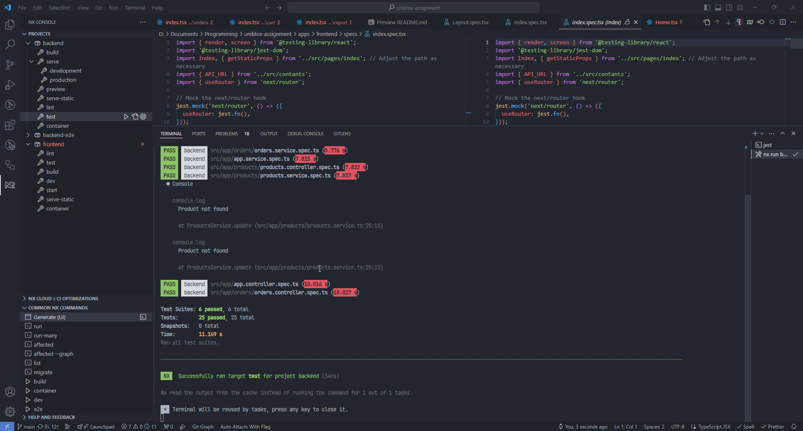

# UnibloxAssignment

Tech Stack:

- NodeJS
- TypeScript
- NestJS
- NextJS
- AntD
- Pnpm
- NX monorepo https://nx.dev

## To test the server do the followings

1. Install dependencies using pnpm

```sh
pnpm i
```

2. Build and run backend server

```sh
pnpm exec nx run backend:serve --configuration=production
```

3. Build and run frontend app

```sh
pnpm exec nx run frontend:start
```

4. Visit http://localhost:3000/



